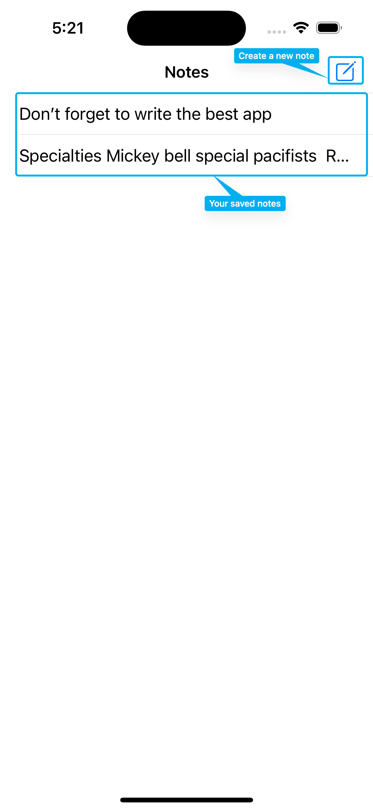
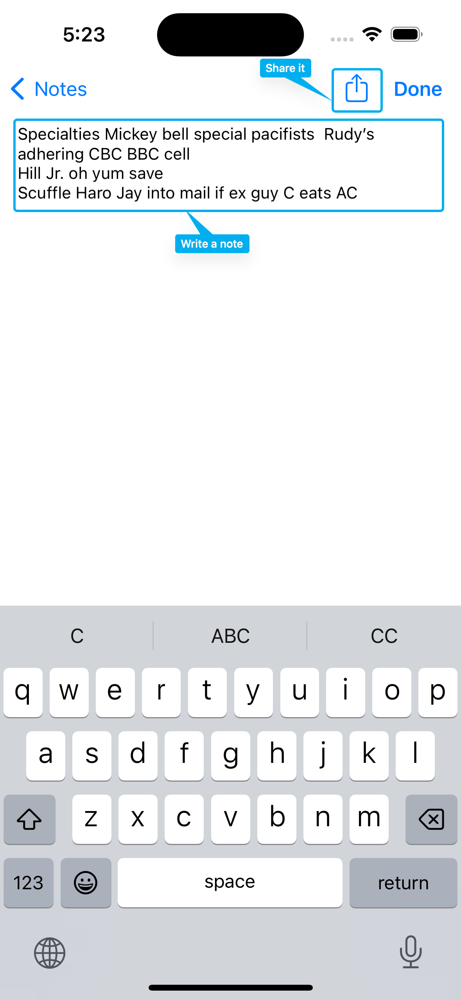
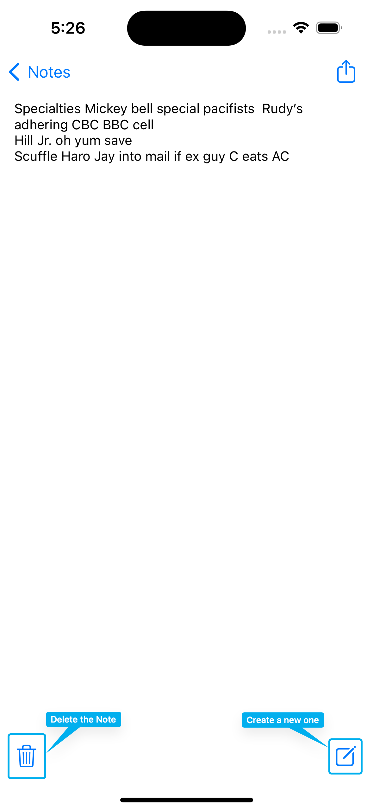

# Notes UIKit

## Description

It is a very simple notes app, that let you write and delete notes. They are saved in UserDefaults. You can share them in other apps.

## Screenshots

    

    

    

## P. S. 

This app was made fully by myself, as a part of **100daysOfSwift** course by **Paul Hudson**. It was a **Milestone**, where you have a small paragraph, describing, what app you have to do this day.